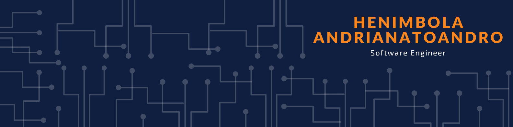

    
    

    
    
    

    <h1>
        Hello World
        
    </h1>

I am a software engineer who is passionate about making open-source more available. I love to create sample, to commit myself in programming technologies.
There are many technologies I love working with like React.js, Angular, Sring Boot, Express.js and so on. But I know that the most important topics in programming are to be good in algorithms, architectures, design patterns, etc. To be better at software engineering, I'm trying to code every day. I will be very happy to work with everyone in an open source project.

## My Stats

## Skills

### Reach out to me on the web :
- Connect : [Linkedin](https://www.linkedin.com/in/henimbola-tsihala-andrianatoandro-1a564a170/)
- Email me : [henimbola@gmail.com](henimbola@gmail.com)
- Follow on [twitter](https://twitter.com/henimbola)